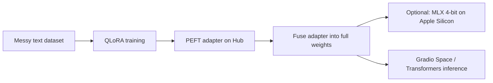

# Chaos-to-Clarity (C2C) — Gemma 4 fine-tune

Fine-tune **Google Gemma 4 E4B (instruction-tuned)** with QLoRA so messy human text becomes **strict YAML** you can route to calendars, reminders, or backends—without sending every message to a huge cloud model.

> [!TIP]
> This repo is built around an **extract-only** schema: one model, one job—turn rambling notes into structured tasks.

## What it does

Users rarely send perfect commands. They send typos, tangents, and multi-topic blurbs. C2C learns to map that noise to a small, machine-readable structure:

- **`is_act`** — whether anything actionable exists (`0` or `1`)
- **`intent`** — coarse label (`remind`, `schedule`, `log`, `notify`)
- **`tasks`** — list of items with **`act`**, **`who`**, **`due`**, **`pri`** (`H` / `M` / `L`)

The model is trained to answer with **YAML only** (no markdown fences, no extra prose).

## Pipeline at a glance



| Stage | Where | Tooling |
|--------|--------|---------|
| Data | `data/*.jsonl` | `generate_c2c_data.py`, `validate_c2c_data.py` |
| Train | Cloud notebook / GPU | `c2c_qlora_training_cell.py` (cells for TRL `SFTTrainer`) |
| Eval | Notebook GPU / Mac MLX | `c2c_predict_eval_cell.py`, `eval_c2c_mlx.py` |
| Fuse | Local or Kaggle | `fuse_c2c_adapter.py` |
| Apple Silicon | Mac | `convert_fused_to_mlx.py` → `demo_c2c_mlx.py` |
| Hosted demo | Hugging Face | `hf_spaces/c2c-demo/` |

## Requirements

- **Python 3.10+** recommended.
- **Training / fuse / Space:** PyTorch, `transformers`, `peft`, `accelerate`, `bitsandbytes` (see script and Space `requirements.txt`).
- **Local MLX demo:** `mlx-lm` on Apple Silicon.
- **Hugging Face:** accept the **Gemma** license on the account you use; use `huggingface-cli login` or env `HF_TOKEN` when models or adapters are private or gated.

> [!NOTE]
> Large weight files (e.g. fused checkpoints, `*.safetensors`) are usually **not** committed—store them on the Hub or locally and point scripts at paths or repo ids.

## Quick start — MLX on Mac

After you have a **fused** model on the Hub (or locally), install MLX tooling and convert:

```bash
python3 -m pip install -U mlx-lm
```

```bash
python scripts/convert_fused_to_mlx.py \
  --hf-path YOUR_USERNAME/c2c-gemma4-e4b-it-fused \
  --mlx-path mlx_models/c2c-gemma4-e4b-it-4bit
```

Run the CLI demo (single prompt or interactive):

```bash
python scripts/demo_c2c_mlx.py \
  --model mlx_models/c2c-gemma4-e4b-it-4bit \
  --prompt "hey remind me to send invoice to Sarah by tomorrow noon and add milk to groceries"
```

For a full **no-retrain** Hub → fuse → MLX walkthrough (including Kaggle-style cells), see the workflow notes in `docs/` when those files are present in your tree (your `.gitignore` may omit them from the remote).

## Scripts (reference)

| Script | Role |
|--------|------|
| `scripts/generate_c2c_data.py` | Build or augment `jsonl` training/eval data |
| `scripts/validate_c2c_data.py` | Quality checks on datasets |
| `scripts/fuse_c2c_adapter.py` | Merge LoRA into full HF weights; optional Hub push |
| `scripts/convert_fused_to_mlx.py` | Quantize fused model to MLX (default 4-bit) |
| `scripts/c2c_mlx_core.py` | Shared MLX prompt / generate / repair (used by demo, eval) |
| `scripts/demo_c2c_mlx.py` | Local inference with `mlx-lm` |
| `scripts/eval_c2c_mlx.py` | MLX eval metrics on `data/test.jsonl` → `reports/` |
| `scripts/c2c_qlora_training_cell.py` | Notebook-oriented training cells |
| `scripts/c2c_predict_eval_cell.py` | Notebook-oriented eval cells |

## Hugging Face Space

The Gradio app under `hf_spaces/c2c-demo/` loads **Gemma 4 E4B** plus a **LoRA adapter** from the Hub (configurable via env vars). See that folder’s `README.md` for deployment notes.

## Project layout

```
├── data/              # train/test jsonl
├── docs/              # workflow and design notes (if tracked)
├── hf_spaces/c2c-demo/   # Gradio Space source
├── notebooks/         # experiments and handoff notebooks
├── reports/           # QC / generation summaries
├── scripts/           # CLI utilities (train, fuse, mlx, data)
└── c2c_output/        # local adapter artifacts (if present)
```

## Acknowledgments

Built with [Google Gemma](https://ai.google.dev/gemma), [Hugging Face Transformers](https://huggingface.co/docs/transformers), [PEFT](https://huggingface.co/docs/peft), and [MLX](https://github.com/ml-explore/mlx) for Apple Silicon inference.
